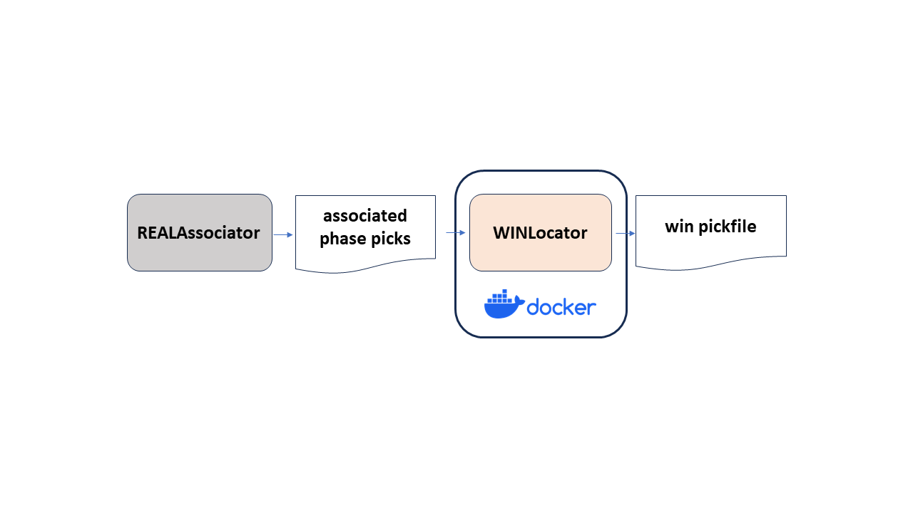

# WINLocator
## Summary


 
* Tool to do hypocenter location from associated phases by WIN system (Urabe and Tsukada, 1992).
* Easy to run on various OS by using **docker**.

## Requirements
* OS <br>
  Support Windows, macOS and Linux

* (Only required for Windows) Git Bash <br>
  https://gitforwindows.org/ <br>
  For Windows, run "Git Bash" as administrator and use it to execute commands for following steps.

* docker <br>
  For Windows and macOS, install "Docker Desktop" and run it to activate docker. <br>
  https://docs.docker.com/get-docker/ <br>

  For Linux, install "Docker Engine". <br>
  https://docs.docker.com/engine/install/ <br>
    ```
    # Installation of docker (e.g. Ubuntu22.04)
    $ sudo apt-get update
    $ sudo apt-get install docker
    $ sudo docker -v # confirm installation
    ```
## Usage
* Installation
  ```
  $ git clone https://github.com/rintr-suzuki/WINLocator.git
  $ cd WINLocator
  ```

* Execution
  ```
  $ ./WINLocator.bash --infile data/associated_picks.json
  # See 'data' directory for the result.
  ```

* See [here](docs/README-usage.md) for the detailed information.

* See [here](docs/Tips.md) for the tips of this tool.

## References
* Hasegawa, A., Umino, N., & Takagi, A. (1978), Double-planed structure of the deep seismic zone in the northeastern Japan arc. Tectonophysics, 47(1–2), 43–58. https://doi.org/10.1016/0040-1951(78)90150-6
* Urabe, T., & Tsukada, S. (1992), win - A Workstation Program for Processing Waveform Data from Microearthquake Networks. Programme and Abstracts, the Seismological Society of Japan, 2, 331-331. (In Japanese)
