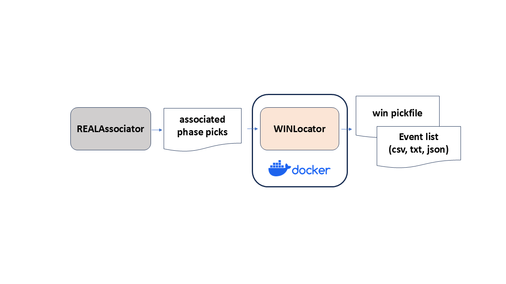

# WINLocator
## Summary

[](https://doi.org/10.1126/science.adt6389)


 
* Tool to do hypocenter location from associated phases by WIN system (Urabe and Tsukada, 1992).
* Easy to run on various OS by using **docker**.

## Requirements
* OS <br>
  Support Windows, macOS and Linux

* (Only required for Windows) Git Bash <br>
  https://gitforwindows.org/ <br>
  For Windows, run "Git Bash" and use it to execute commands for following steps.

* docker <br>
  * Installation <br>
  For Windows and macOS, install "Docker Desktop" and run it to activate docker. <br>
  https://docs.docker.com/get-docker/ <br>
  For Linux, install "Docker Engine". <br>
  https://docs.docker.com/engine/install/ <br>

  * (Only required for Linux) Create the docker group and add your user <br>
  https://docs.docker.com/engine/install/linux-postinstall/#manage-docker-as-a-non-root-user <br>

  * Verify installation <br>
    ```
    $ docker run hello-world
    ...
    Hello from Docker!
    This message shows that your installation appears to be working correctly.
    ...
    ```
    
## Usage
* Installation
  ```
  $ git clone https://github.com/rintr-suzuki/WINLocator.git
  $ cd WINLocator
  ```

* Execution
  ```
  $ ./WINLocator.bash --infile data/associated_picks.json
  # See 'data' directory for the result.
  ```

* See [here](docs/README-usage.md) for the detailed information.

* See [here](docs/Tips.md) for the tips of this tool.

## References
* Hasegawa, A., Umino, N., & Takagi, A. (1978), Double-planed structure of the deep seismic zone in the northeastern Japan arc. Tectonophysics, 47(1–2), 43–58. https://doi.org/10.1016/0040-1951(78)90150-6
* Tamaribuchi, K., Hirose, F., Noda, A., Iwasaki, Y., Iwakiri, K., & Ueno, H. (2021), Noise classification for the unified earthquake catalog using ensemble learning: the enhanced image of seismic activity along the Japan Trench by the S-net seafloor network. Earth, Planets and Space, 73, 91. https://doi.org/10.1186/s40623-021-01411-6
* Urabe, T., & Tsukada, S. (1992), win - A Workstation Program for Processing Waveform Data from Microearthquake Networks. Programme and Abstracts, the Seismological Society of Japan, 2, 331-331. (In Japanese)
